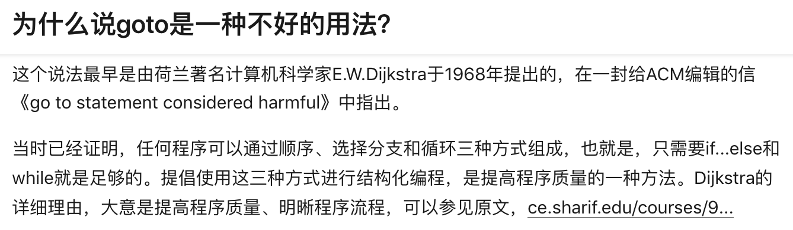
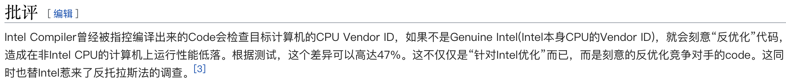

### 一门高级程序设计语言需要什么

- 常量和变量

  顾名思义，变量就是会变化的量，常量就是不会变的量

  给变量取名字也是一门艺术（代码会说话，注释就变得更简练而高效）

- 运算

  基础运算：加减乘除，求余，运算的优先级（+ - * / %）

  关系运算：大于小于 大于等于小于等于 不等于 等于 （>  <  >=  <=  !=  ==）

  位运算：按位与，按位或，按位取反，按位异或，左移右移（ & | ~ ^  <<  >>）

  逻辑运算：逻辑与，逻辑或，逻辑取反（ ! && || ）

  赋值运算：=， 带上运算的赋值 +=  -=  *=  /=  %= 

  C语言中的一些特色运算（也叫语法糖（用好了使人愉悦，用不好就令人窒息））：  ++自增++， --自减-- ，

  杂项运算符：获得一个变量的大小 sizeof， 获得一个变量的地址 &， 指向一个变量 *，条件表达式 ?: （在判断部分详细讲）

- 判断

  条件是否成立，成立做什么，不成立又做什么

  C语言中大概可以算有三种判断模式：

  - if else 如果xxx，做xxx，要不然做yyy

  - switch case 要去xx教室，这个教室上cc课

  - 我的意见 == 老婆意见 ? 听我的 : 听老婆的  （耙耳朵表达式٩(｡・ω・｡)و ） 

    

- 循环

  简单的说，就是复读（笑），可以只复读一句，也可以复读一组句子，还可以在复读中再发起新的复读（嵌套循环）

  PS：以下叙述均可以直接将“复读”二字改成“循环”

  - 复读的方式有

    - 直接开始复读 while、 for（其实这也是一种语法糖，但是基本上所有面向过程的语言都有这种循环方式）
    - 先读一次再看复不复读do{ ... }while

  - 打断复读的方式有

    - continue （这次复读到此结束，直接进入下一次复读）

    - break （这个复读到此结束（也可以称为跳出这个复读），break相当于跳出当前循环或者switch语句的大括号）

    - goto 别复读了你妈喊你回家吃饭（根据Dijkstra这位大佬的批判，goto语句就给安排的明明白白的，附上知乎讨论https://www.zhihu.com/question/20259336）

      

- 留到下次再讲的内容

  - 函数
  - 作用域
  - 数组
  - 指针（C的精髓）
  - 输入输出
  - 递归
  - To be continued

### 二进制

逢二进一，上次课说到一个比特用处不大，到了8个bit开始有点用处（参见8bit文化），所以8bit又叫一个字节(Byte)

#### ASCII

经典的ASCII表如上图，从0-127一共定义了128个符号

这时候你可能会问，128个符号岂不是7个bit就能够表示完了，为啥要8个，那是因为当时还没想好另外128个放什么，就给剩的那个bit固定，先不管，然后又过了不久，大家想到了剩下的128个放什么

#### 编码

上面的256个字符也不行啊，一个中文都没有，但是8个bit最多就这样了，所以后来就出现了Unicode这种更长的编码方案（用了16个bit，也就是ASCII的两倍来表示字符）。

现在用得比较多，可能大家都有听说过的就是utf-8这种编码

> **UTF-8**（**8-bit Unicode Transformation Format**）是一种针对[Unicode](https://zh.wikipedia.org/wiki/Unicode)的可变长度[字符编码](https://zh.wikipedia.org/wiki/%E5%AD%97%E5%85%83%E7%B7%A8%E7%A2%BC)，也是一种[前缀码](https://zh.wikipedia.org/wiki/%E5%89%8D%E7%BC%80%E7%A0%81)。它可以用来表示Unicode标准中的任何字符，且其编码中的第一个[字节](https://zh.wikipedia.org/wiki/%E5%AD%97%E8%8A%82)仍与[ASCII](https://zh.wikipedia.org/wiki/ASCII)兼容，这使得原来处理ASCII字符的[软件](https://zh.wikipedia.org/wiki/%E8%BB%9F%E9%AB%94)无须或只须做少部分修改，即可继续使用。因此，它逐渐成为[邮箱](https://zh.wikipedia.org/wiki/%E9%9B%BB%E5%AD%90%E9%83%B5%E4%BB%B6)、[网页](https://zh.wikipedia.org/wiki/%E7%B6%B2%E9%A0%81)及其他[存储](https://zh.wikipedia.org/wiki/%E5%84%B2%E5%AD%98%E8%A3%9D%E7%BD%AE)或发送文字的应用中，优先采用的编码。

看起来要伸缩自如大家才买帐 (●'◡'●)ﾉ 

#### 浮点数和定点数

这里的点都是代表了小数点，浮点的意思就是小数点是浮动的，而定点数则是固定的（这个我会在讲float和double的区别的时候详细讲）

### IDE包含了哪些东西

- 文本（代码）编辑器

  - 远古时期  Vi, nano, emacs
  - 有图形界面的可能要钱的 EditPlus, Notepad++,  UltraEdit
  - 不要钱而且现在比较火的 Atom, Sublime Text, VS code 

- 编译器

  - msvc 微软出品，Visual Studio中自带，一般没有人单独下载

  - gcc GNU项目出品，开源，Linux中自带，CodeBlocks也是用gcc进行编译

  - clang(LLVM) 苹果支持出品，开源，macOS中不自带，需要自己去苹果官网下载Xcode，Linux以及Windows中均可下载使用

  - icc 因特尔出品，要钱，没用过不做评价，维基百科有一段黑点

    

  - nvcc 英伟达出品，可以编译出支持Nvidia显卡的并行计算代码

- 链接器

  - VS用的是微软是自己写的，好像有个名字叫 ld.exe，没有更多信息了
  - Unix-like的系统一般都会使用GNU出的 ld

- 调试器

  - Microsoft Visual Studio Debugger 微软VS中自带的调试器，可以说没有名字，真惨
  - gdb GNU项目出品，足够强大且开源，和gcc是一套
  - lldb 苹果出品，和clang是一套

- 工程管理（文件管理）

  - ctags

- 版本控制（可选）

  - Git
  - Subversion （SVN）
  - BitKeeper